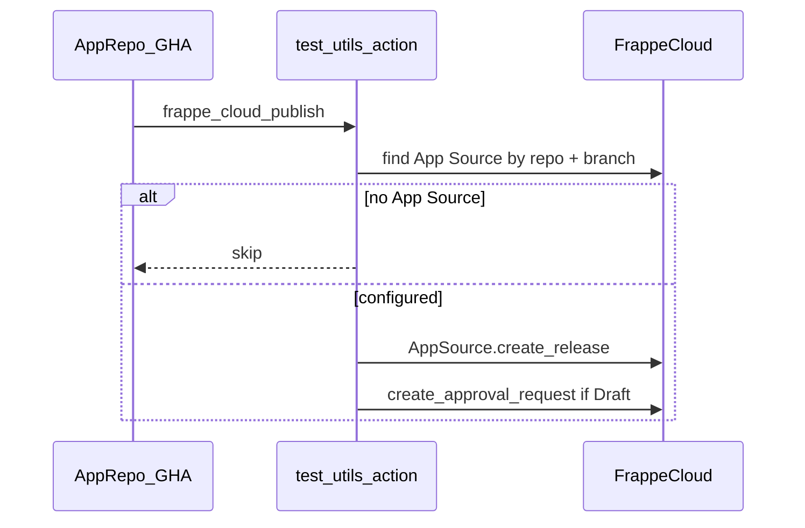

# Frappe Cloud Marketplace Publish

Register and submit [Frappe Cloud Marketplace](https://docs.frappe.io/cloud/marketplace/manage-marketplace-app) app releases after a **merged PR** to your publish branch. This is **update-only**: it finds the `App Release` (created by the FC GitHub webhook) and submits it for marketplace publishing. It does **not** deploy or update benches.

## Workflow



Frappe Cloud is the source of truth for which apps are publishable. **test_utils ships only the composite action** — it does not run publish workflows and must not store `FC_API_KEY` / `FC_API_SECRET`. Each marketplace app repo adds the workflow below and holds (or inherits org) FC credentials.

## Usage

Add `.github/workflows/frappe-cloud-publish.yaml` to a marketplace app repo:

```yaml
name: Publish to Frappe Cloud Marketplace

on:
  pull_request:
    types:
      - closed
    branches: [version-15]   # must match App Source.branch on FC
  workflow_dispatch:
    inputs:
      dry_run:
        description: Resolve FC config only; do not submit approval
        required: false
        default: true
        type: boolean

jobs:
  publish:
    if: github.event_name == 'workflow_dispatch' || github.event.pull_request.merged == true
    runs-on: ubuntu-latest
    concurrency: fc-publish-${{ github.repository }}
    steps:
      - uses: agritheory/test_utils/actions/frappe_cloud_publish@<pin-sha>
        with:
          fc-api-key: ${{ secrets.FC_API_KEY }}
          fc-api-secret: ${{ secrets.FC_API_SECRET }}
          branch: version-15
          dry-run: ${{ github.event_name == 'workflow_dispatch' && inputs.dry_run && 'true' || 'false' }}
          # app-name: my_app   # only if repo basename ≠ FC app name
```

The workflow runs when a PR into the publish branch is **merged**, not on every push. Direct pushes to the publish branch do not trigger it (use `workflow_dispatch` to publish manually). Frappe Cloud still creates `App Release` records via the GitHub webhook on push; this workflow only submits them for marketplace approval.

### GitHub secrets (app repos only)

Store `FC_API_KEY` and `FC_API_SECRET` as **organization secrets** (recommended, shared across marketplace repos) or **repository secrets** on each app repo. **Do not** add these to `test_utils`.

| Secret | Description |
|--------|-------------|
| `FC_API_KEY` | Frappe Cloud API key (publisher team user) |
| `FC_API_SECRET` | Frappe Cloud API secret |
| `FC_TEAM` | Optional when you belong to one team. **Required** when you belong to multiple teams. Use `--list-teams` locally to see values. |

Generate keys from Frappe Cloud dashboard → **Settings → Profile & Team → API Access → Create New API Key**. Copy the **API Secret** immediately — it is shown only once.

Frappe Cloud only allows token-authenticated calls under `press.api.*` (not generic `frappe.*` endpoints). The publish action uses marketplace APIs plus optional release polling via the GitHub webhook.

### Verify credentials locally

```bash
export FC_API_KEY="..."
export FC_API_SECRET="..."

# List teams (pick the one that owns your marketplace apps)
python actions/frappe_cloud_publish/publish_marketplace_release.py --list-teams

# Set the publisher team, then dry-run
export FC_TEAM="your-team-name@example.com"
python actions/frappe_cloud_publish/publish_marketplace_release.py \
  --repository agritheory/check_run \
  --branch version-15 \
  --dry-run
```

The API key must belong to a user with a **Marketplace developer account** ([Become a Publisher](https://docs.frappe.io/cloud/marketplace/publishing-an-app-to-marketplace) on the FC Profile tab).

### Frappe Cloud prerequisites

Before enabling the workflow for an app:

1. [Publish the app to the marketplace](https://docs.frappe.io/cloud/marketplace/publishing-an-app-to-marketplace) — `Marketplace App` exists
2. `App Source` is enabled with correct `repository_owner`, `repository`, and `branch`
3. GitHub App is connected on FC for the repo (webhook backup; action force-polls via `create_release`)

### Deploy guard checklist

Confirm these are **not** set for marketplace publish branches, or `App Release.after_insert` may trigger bench deploys:

- [ ] No `Release Group App.enable_auto_deploy` for the app's `App Source`
- [ ] No `auto-deploy` resource tag on publisher release groups
- [ ] No `deploy_marker` string in commit messages on the publish branch

### Action inputs

| Input | Default | Description |
|-------|---------|-------------|
| `repository` | workflow repo | `owner/repo` slug |
| `branch` | `version-15` | Must match `App Source.branch` |
| `app-name` | (derived) | Override when multiple sources match |
| `fc-base-url` | `https://cloud.frappe.io` | FC site URL. Do **not** use `https://frappecloud.com` — it redirects and strips API auth headers. |
| `commit-hash` | HEAD | Optional pin for `create_release` |
| `dry-run` | `false` | Resolve FC config only |

### Onboarding a new marketplace app

1. Configure `Marketplace App` + `App Source` on Frappe Cloud
2. Add the workflow file to the GitHub repo (PR target branch must match `App Source.branch`)
3. Ensure `FC_API_KEY` / `FC_API_SECRET` are available to the **app repo** (org or repo secrets)
4. Merge a PR into the publish branch and verify the Releases tab on FC

Manual test (after the workflow file is on the repo default branch):

```bash
gh workflow run "Publish to Frappe Cloud Marketplace" \
  --repo agritheory/check_run \
  --ref version-15 \
  -f dry_run=true
```

### Marketplace apps (rollout)

Add the workflow to each repo when ready:

- agritheory/approvals
- agritheory/check_run
- agritheory/cloud_storage
- agritheory/beam
- agritheory/communications
- agritheory/inventory_tools
- agritheory/electronic_payments
- agritheory/forecast
- agritheory/autoreader
- agritheory/saml
- agritheory/fleet
- agritheory/shipstation_integration
- agritheory/taxjar_erpnext
- agritheory/frappe_vault

Adjust `branch` in the workflow to match each app's FC `App Source` branch (most use `version-15`).
