# SQL Registry

A tool for scanning, analyzing, and converting `frappe.db.sql` calls to Frappe Query Builder or ORM equivalents.

## Overview

The SQL Registry scans Python files for `frappe.db.sql` calls, analyzes the SQL queries, and generates equivalent Query Builder or ORM code. This helps with:

- **Auditing** - Understanding SQL usage across a codebase
- **Migration** - Converting raw SQL to Query Builder for better security and maintainability
- **Quick Wins** - Identifying simple queries that can use `frappe.get_all` instead

Registry data is stored as **JSON** (`.sql_registry.json`), which is human-readable, diffable, and portable. If an existing `.sql_registry.pkl` (pickle) file is found and no JSON registry exists, it is automatically migrated on first load.

## Installation

The `sql_registry` command is included with test_utils:

```bash
pip install test_utils
# or
poetry add test_utils
```

## CLI Commands

### Scan a Directory

Scan Python files for SQL operations:

```bash
sql_registry scan --directory /path/to/app [--registry .sql_registry.json] [--include-patches]
```

Options:
- `--directory` - Directory to scan (default: current directory)
- `--registry` - Registry file path (default: `.sql_registry.json`)
- `--include-patches` - Include SQL in patch/migration files. **Patches are excluded by default** since they are one-time migrations and typically don't need conversion.

This creates a `.sql_registry.json` file containing all discovered SQL calls.

### List SQL Calls

List all SQL calls in the registry:

```bash
sql_registry list [--registry .sql_registry.json] [--file-filter myfile.py]
```

### Show Call Details

Show detailed information about a specific SQL call:

```bash
sql_registry show <call_id> [--registry .sql_registry.json]
```

Output includes:
- Original SQL query
- Extracted parameters
- Query Builder equivalent
- Status indicators (`✅ Query Builder`, `💡 ORM-ELIGIBLE`, `🔧 Manual Review`, `⚠️ HAS TODO`)

### List TODOs

List calls that need manual review (have TODO comments in the conversion):

```bash
sql_registry todos [--registry .sql_registry.json]
```

### List ORM-Eligible Calls

List simple queries that can use `frappe.get_all`:

```bash
sql_registry orm [--registry .sql_registry.json]
```

These are quick wins - simple SELECT queries on single tables that don't need Query Builder.

### Generate Report

Generate a markdown report of all SQL operations:

```bash
sql_registry report [--registry .sql_registry.json] [--output sql_report.md]
```

The report includes:
- Conversion status summary (Query Builder, ORM-eligible, Manual Review, TODOs)
- Implementation distribution (frappe_db_sql, query_builder, mixed)
- Per-file breakdown with status indicators and SQL preview for each call

### Rewrite SQL Call

Preview or apply Query Builder conversion for a single call:

```bash
# Preview changes (dry run)
sql_registry rewrite <call_id> [--registry .sql_registry.json]

# Apply changes to file
sql_registry rewrite <call_id> --apply [--registry .sql_registry.json]
```

Only calls with **✅ Query Builder** or **💡 ORM-eligible** status can be rewritten. Calls marked **🔧 Manual Review** require manual conversion.

## Conversion Status

| Status | Meaning |
|--------|---------|
| ✅ Query Builder | Validated conversion ready to apply via `rewrite --apply` |
| 💡 ORM-eligible | Simple query, can use `frappe.get_all` instead |
| 🔧 Manual Review | Validation failed - complex query needs manual conversion |
| ⚠️ Has TODOs | Conversion has TODO comments requiring attention |

## Supported SQL Patterns

The converter handles:

| SQL Pattern | Query Builder Equivalent |
|-------------|--------------------------|
| `SELECT ... FROM` | `frappe.qb.from_(...).select(...)` |
| `WHERE field = %s` | `.where(table.field == value)` |
| `IS NULL` / `IS NOT NULL` | `.isnull()` / `.isnotnull()` |
| `IFNULL()` / `COALESCE()` | `fn.Coalesce(field, value)` |
| `IN (subquery)` | `.isin(SubQuery(...))` |
| `NOT IN (subquery)` | `.notin(SubQuery(...))` |
| `EXISTS (subquery)` | `ExistsCriterion(...)` |
| `DATEDIFF()` | `CustomFunction('DATEDIFF', ...)` |
| `COUNT()`, `SUM()`, `AVG()` | `fn.Count()`, `fn.Sum()`, `fn.Avg()` |
| `GROUP BY` | `.groupby(...)` |
| `HAVING` | `.having(...)` |
| `ORDER BY` | `.orderby(..., order=frappe.qb.desc)` |
| `LIMIT` | `.limit(n)` |
| `BETWEEN` | `field[start:end]` |
| Arithmetic (`+`, `-`, `*`, `/`) | Native operators |

## ORM-Eligible Queries

Simple queries are automatically converted to `frappe.get_all`:

**Original:**
```python
frappe.db.sql("""
    SELECT name, status FROM `tabSales Order`
    WHERE customer = %s AND docstatus = 1
""", (customer,), as_dict=True)
```

**Converted:**
```python
frappe.get_all(
    "Sales Order",
    filters={"customer": customer, "docstatus": 1},
    fields=["name", "status"]
)
```

A query is ORM-eligible when:
- Single table (no JOINs)
- No aggregations (COUNT, SUM, etc.)
- No GROUP BY or HAVING
- No subqueries
- Simple WHERE conditions

## Frappe v16 Compatibility

The converter generates v16-compatible ORM syntax for:

### IFNULL/COALESCE in Filters

**Original SQL:**
```python
frappe.db.sql("""
    SELECT name FROM tabDepartment
    WHERE ifnull(company, '') != ''
""")
```

**v16 ORM Output:**
```python
from frappe.query_builder import Field
from frappe.query_builder.functions import IfNull

frappe.get_all(
    "Department",
    filters=[[IfNull(Field("company"), ""), "!=", ""]]
)
```

### DISTINCT Queries

**Original SQL:**
```python
frappe.db.sql("""
    SELECT DISTINCT parent FROM `tabBOM Operation`
    WHERE workstation = %s
""", (workstation,))
```

**v16 ORM Output:**
```python
frappe.get_all(
    "BOM Operation",
    filters={"workstation": workstation},
    fields=["parent"],
    distinct=True
)
```

### v16 Breaking Changes

Frappe v16 changed how `frappe.get_all()` handles fields and filters internally (now using Pypika Query Builder). Raw SQL strings for functions are **no longer supported**:

```python
# OLD (broken in v16)
frappe.get_all("DocType", fields=["sum(qty) as total"])

# NEW (v16 compatible)
frappe.get_all("DocType", fields=[{"SUM": "qty", "as": "total"}])
```

The converter automatically uses the Query Builder path for aggregate queries, which generates valid pypika syntax that works in both v15 and v16.

## How It Works

### Conversion Pipeline

Every `frappe.db.sql` call passes through five stages before it reaches the registry.

```mermaid
flowchart TD
    SRC("📄 Python source file\nfrappe.db.sql(&quot;SELECT …&quot;, params)")

    SRC --> AST

    subgraph AST ["① Python AST — understand the call site"]
        A1["Detect frappe.db.sql call"]
        A2["Extract SQL string"]
        A3["Extract params\nast.Constant → raw literal\nast.Name / Attribute / Call → VarRef"]
        A4["Detect assignment context\nvariable name / return / for-loop / expression"]
        A1 --> A2 & A3 & A4
    end

    AST --> SQL

    subgraph SQL ["② SQL Parsing — understand the query"]
        S1["Replace %s / %(name)s / {expr}\nwith internal placeholders"]
        S2["sqlglot.parse() → SQL AST"]
        S1 --> S2
    end

    SQL --> ELIG

    subgraph ELIG ["③ Eligibility Check"]
        E1{"All named params\nresolvable?"}
        E2{"No dynamic\ntable names?"}
    end

    ELIG -->|No| MAN1("🔧 Manual Review\n— stored in registry,\nskipped by rewrite")

    ELIG -->|Yes| CONV

    subgraph CONV ["④ Conversion — choose the right target"]
        C1{"Single table?\nNo JOINs, aggregations,\nor subqueries?"}
        C2["convert_select_to_orm()\n→ frappe.get_all(…)"]
        C3["SQLToQBConverter\n→ frappe.qb chain\n  UPDATE → frappe.db.set_value or QB\n  DELETE → frappe.db.delete or QB"]
        C1 -->|Yes — ORM path| C2
        C1 -->|No — QB path| C3
    end

    CONV --> VAL

    subgraph VAL ["⑤ Validation — verify structural equivalence"]
        V1["Extract structure from original SQL AST\n(tables, fields, conditions, LIMIT …)"]
        V2["Extract structure from generated QB code\nvia Python AST"]
        V3{"Structures match?"}
        V1 & V2 --> V3
    end

    VAL -->|No| MAN2("🔧 Manual Review\n— generated template\ncommented out")
    VAL -->|Yes| OK("✅ Ready to apply\nstored in .sql_registry.json")

    style MAN1 fill:#fff3cd,stroke:#ffc107
    style MAN2 fill:#fff3cd,stroke:#ffc107
    style OK   fill:#d1e7dd,stroke:#198754
```



### Applying a Conversion

Once a call has `✅` status in the registry, `rewrite --apply` writes it back to the source file.

#### Pin-drop strategy: from line numbers to structural XPath

Early versions located the call by line number, then re-scanned the entire directory after each write to refresh stale line numbers. This was fragile: any edit to the file invalidated every other call's ID.

The current approach stores a structural **XPath address** (`ast_path`) for each call at scan time, e.g.:

```
/Module/body[3]/FunctionDef/body[2]/For/iter/Call
```

This path encodes the call's position in the Python AST, not its line number. It survives whitespace changes, comment edits, and sibling conversions that shift line numbers — as long as the surrounding statement structure is unchanged. No re-scan is needed between rewrites.

#### Batch write pipeline

`rewrite_batch` groups calls by file, then dispatches each file to a worker in a `ProcessPoolExecutor`. Each worker runs the full pipeline independently:

```mermaid
flowchart TD
    REG[(".sql_registry.json\nquery_builder_equivalent\nast_path")]

    REG --> BATCH

    subgraph BATCH ["rewrite_batch() — main process"]
        B1["Group calls by file"]
        B2["ProcessPoolExecutor\n(one worker per CPU)"]
        B1 --> B2
    end

    BATCH --> WORKER

    subgraph WORKER ["_rewrite_file_calls() — worker process (per file)"]
        W1["Parse AST once\nast.parse(content)"]
        W2["Build XML tree once\nastpath.convert_to_xml()"]
        W3["asttokens — char positions\nfor all targets in one pass"]
        W4["Collect all splices\n(call ranges + DocType inserts)"]
        W5["Apply right-to-left\none string operation"]
        W6["_ensure_imports()\nhoist missing imports to module level"]
        W7["black.format_str()\nPython API — no subprocess"]
        W8{"Compile check\nast.parse()"}
        W9["Write file\nremove .bak + __pycache__"]
        W1 --> W2 --> W3 --> W4 --> W5 --> W6 --> W7 --> W8
        W8 -->|Pass| W9
        W8 -->|Fail| ABORT("Abort — file untouched\n(or write with --force)"]
    end

    WORKER --> DONE("✓ Registry updated\nfor all written files")

    style DONE fill:#d1e7dd,stroke:#198754
    style ABORT fill:#fff3cd,stroke:#ffc107
```

**Key design decisions:**

| Old approach | Current approach |
|---|---|
| Line-number call IDs | Structural XPath IDs (`ast_path`) |
| Re-scan directory after each rewrite | No rescan needed — XPath is stable |
| Sequential file processing | Parallel across files (`ProcessPoolExecutor`) |
| One `ast.parse` + `convert_to_xml` per call | One parse + one XML build per *file* |
| `black` subprocess + temp file per file | `black.format_str()` Python API in-process |
| `replace_sql_in_content` called N times, each re-parsing | Splices collected in one pass, applied right-to-left |

### The VarRef Type

A key design insight: Python SQL params contain two fundamentally different kinds of values that must be rendered differently in generated code.

```mermaid
flowchart LR
    subgraph IN ["frappe.db.sql params dict"]
        P1["{'as_of_date': as_of_date}\nast.Name → variable reference"]
        P2["{'status': 'Active'}\nast.Constant → string literal"]
        P3["{'amount': 100}\nast.Constant → numeric literal"]
    end

    subgraph EXTRACT ["extract_params_from_call()"]
        E1["VarRef('as_of_date')\nemit unquoted"]
        E2["'Active'\nraw str — emit quoted"]
        E3["100\nraw int — emit as-is"]
    end

    subgraph OUT ["Generated filter"]
        O1["['start_date', '<=', as_of_date]"]
        O2["{'status': 'Active'}"]
        O3["{'amount': 100}"]
    end

    P1 --> E1 --> O1
    P2 --> E2 --> O2
    P3 --> E3 --> O3
```



`VarRef` objects survive JSON serialization in the registry as `"__varref__:<expr>"` and are reconstructed on load, so the distinction is preserved across sessions.

## Example Workflow

```bash
# 1. Scan your app (from test_utils or with test_utils installed)
poetry run sql_registry scan --directory ~/frappe-bench/apps/myapp

# 2. Check for quick wins (ORM-eligible)
poetry run sql_registry orm

# 3. Check for issues needing manual review
poetry run sql_registry todos

# 4. Generate a report for the team
poetry run sql_registry report --output myapp_sql_audit.md

# 5. Preview a conversion
poetry run sql_registry show abc12345

# 6. Apply a conversion (only for ✅ or 💡 status)
poetry run sql_registry rewrite abc12345 --apply
```

The registry file (`.sql_registry.json`) is typically added to `.gitignore` since it's project-local scan data.

## Scanning Multiple Codebases

Use `--registry` to maintain separate registries per app:

```bash
# Scan each app with its own registry
poetry run sql_registry scan --directory ~/bench/apps/erpnext --registry .sql_registry_erpnext.json
poetry run sql_registry scan --directory ~/bench/apps/hrms --registry .sql_registry_hrms.json
poetry run sql_registry scan --directory ~/bench/apps/myapp --registry .sql_registry_myapp.json

# Generate reports
poetry run sql_registry report --registry .sql_registry_erpnext.json --output erpnext_sql_report.md
poetry run sql_registry report --registry .sql_registry_hrms.json --output hrms_sql_report.md
```

## Full Codebase Audit

To audit an entire Frappe/ERPNext installation:

```bash
cd /path/to/test_utils
rm -f .sql_registry.json
poetry run sql_registry scan --directory ~/frappe-bench/apps/erpnext/erpnext
poetry run sql_registry report --output erpnext_sql_report.md
```

Use `poetry run sql_registry` (or `python -m sql_registry`) when running from the test_utils repo.

## Known Limitations (Manual Review Required)

The following patterns require **🔧 Manual Review** and cannot be auto-rewritten:

1. **Dynamic SQL** - Queries with `{}` f-string placeholders for dynamic conditions
2. **Complex Subqueries** - Deeply nested or correlated subqueries
3. **Database-specific Functions** - MySQL-specific functions (e.g. `ROW_COUNT()`, `information_schema` queries) without direct Query Builder equivalents
4. **Multi-table JOINs** - Some JOIN patterns may not validate correctly
5. **Patches/Migrations** - SQL in patch files is excluded by default; use `--include-patches` to include them

## Package Structure

The sql_registry is implemented as a package (`test_utils/utils/sql_registry/`):

| Module | Purpose |
|--------|---------|
| `models.py` | `SQLCall` (incl. `ast_path` field), `SQLStructure`, `VarRef`, `UnresolvedParameterError` |
| `scanner.py` | AST scanning, param extraction (`VarRef` for variable refs), ORM conversion |
| `converter.py` | `SQLToQBConverter` — SQL→Query Builder, positional `%s` mapping |
| `registry.py` | `SQLRegistry` — load/save, scan with XPath extraction, report generation |
| `cli.py` | `main()` — argparse and command dispatch |

The rewriter lives in `test_utils/pre_commit/sql_rewriter_functions.py`:

| Symbol | Kind | Purpose |
|--------|------|---------|
| `apply_black` | function | Format Python with `black.format_str()` — no subprocess |
| `locate_call_node` | function | Find AST Call via XPath (primary) or SQL-text+occurrence (fallback) |
| `locate_enclosing_stmt_node` | function | Find enclosing statement for DocType line insertion |
| `rewrite_file_calls` | function | Full per-file pipeline — picklable worker for `ProcessPoolExecutor` |
| `FileRewriteResult` | dataclass | Structured result from worker process |
| `split_qb_code` | function | Split QB equivalent into `(imports, doctype_lines, expr)` |
| `ensure_imports` | function | Hoist missing imports to module level (AST-aware, deduplicating) |
| `SQLRewriter` | class | CLI entry point — orchestrates scan, show, rewrite |

Backward-compatible imports remain unchanged:

```python
from test_utils.utils.sql_registry import SQLRegistry, SQLCall, main
```

## See Also

- [Frappe Query Builder Documentation](https://frappeframework.com/docs/user/en/api/query-builder)
- [pypika Documentation](https://pypika.readthedocs.io/)
